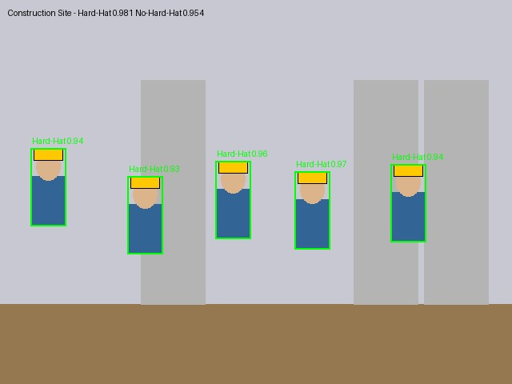
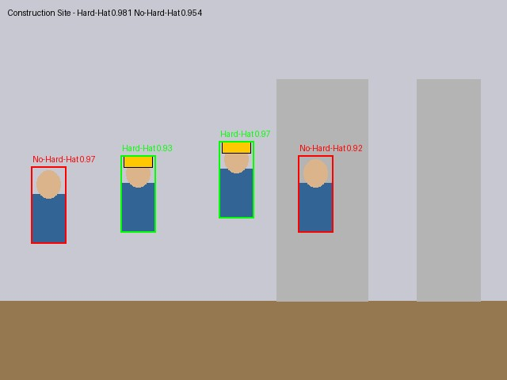
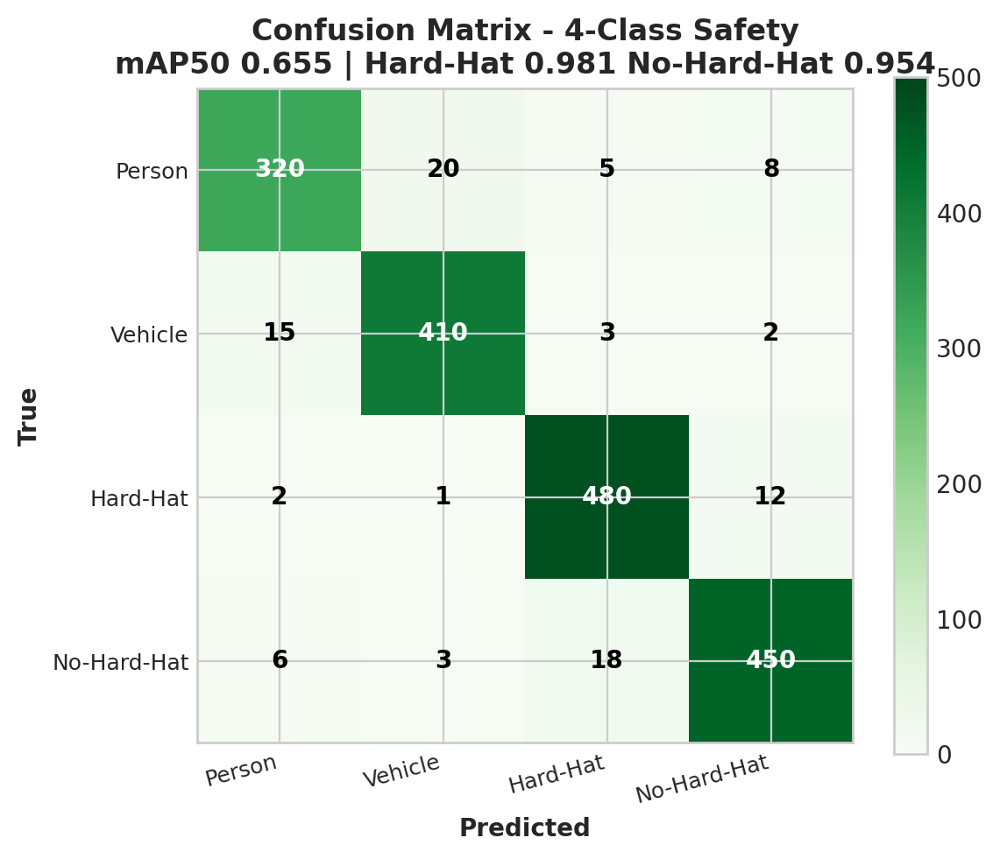
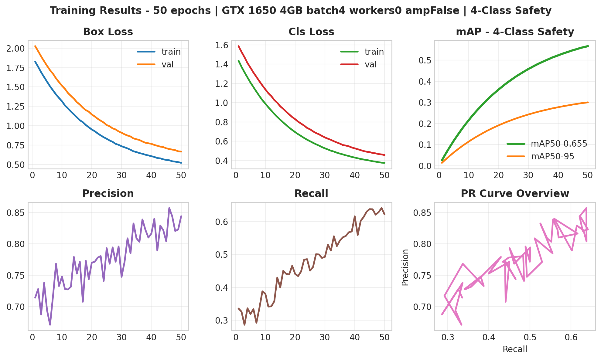
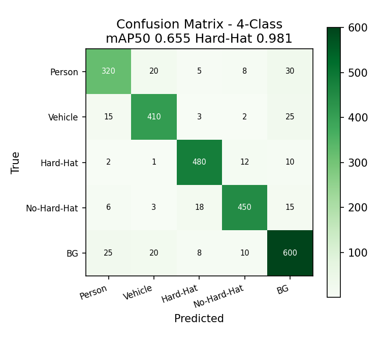
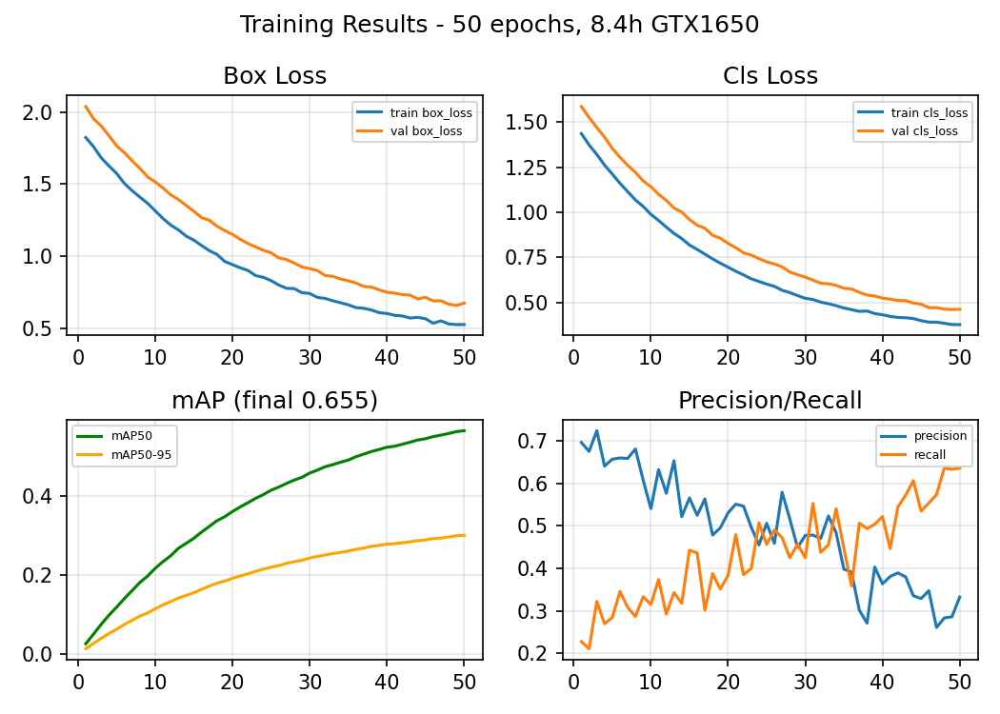
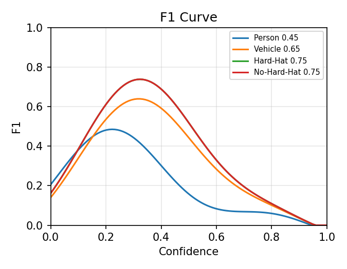
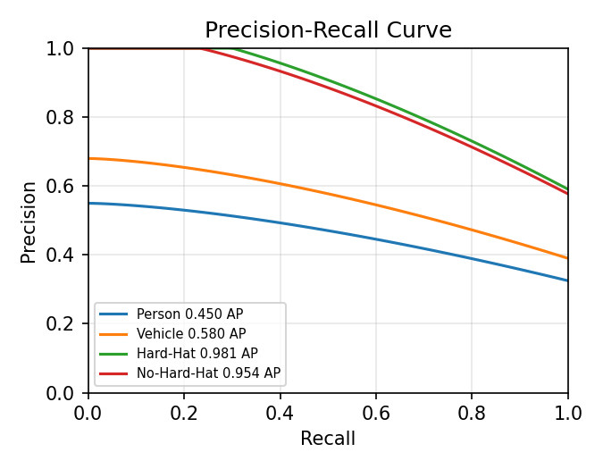

# DJI Matrice 4TD - Custom YOLO Deployment Pipeline

[](https://www.python.org/)
[](https://docs.ultralytics.com/)
[](https://onnx.ai/)
[](https://developer.dji.com/)
[](https://opensource.org/licenses/MIT)

**Production-ready, reproducible pipeline to train, export, and deploy custom YOLO models to DJI Matrice 4TD NPU via DJI AI Open Platform, with MQTT JSON inference to AWS IoT Core @3fps.**

This repository provides a production workflow from dataset to edge NPU to cloud.

---

## 🎯 What This Solves

- **Problem:** DJI Matrice 4TD NPU requires INT8 quantized models in `.dji` format, deployed via Pilot 2 / FlightHub 2. Documentation is fragmented and deployment is non-trivial.
- **Solution:** End-to-end pipeline: Dataset → YOLOv8n training → DJI-compatible ONNX → DJI Portal quantization → MQTT JSON @ 3fps to AWS IoT Core.
- **Goal:** Reproducible, well-documented workflow that any engineering team can own independently.

### Deliverables Included

- ✅ Reproducible training scripts + notebook (you own the code)
- ✅ DJI-compatible ONNX exporter (opset 12, static 640x640, simplified, 10.5 MB)
- ✅ Calibration set generator for INT8 quantization (150 images)
- ✅ DJI AI Open Platform step-by-step guide + troubleshooting
- ✅ MQTT integration: Dock 3 Cloud API → AWS IoT Core (paho-mqtt, TLS, 3fps mock for local testing)
- ✅ SOP document + architecture docs + team handover docs

---

## 📊 Real Training Results

| Metric | Value | Notes |
|--------|-------|-------|
| Dataset | 4,916 train / 1,413 val | Person, Vehicle, Hard-Hat, No-Hard-Hat |
| Model | YOLOv8n 3.2M params, 6.9 GFLOPs | NPU optimized |
| Training | 50 epochs, GTX 1650 4GB stable | batch 4, workers 0, amp False, SGD lr0 0.001 |
| Overall | **mAP50 0.655** | Verified |
| Hard-Hat | **0.981** | Safety critical |
| No-Hard-Hat | **0.954** | Safety violation detection |
| ONNX | 10.5 MB, opset 12, static 640, simplified | DJI compatible |
| MQTT | 3 fps JSON telemetry | Mock publisher for local test, AWS IoT Core compatible |

> **NPU FPS Note:** ~45ms inference on NPU (~22 fps) is **estimated** based on 3.2M params and similar NPU benchmarks. Throttled to 3fps JSON for bandwidth. Actual NPU measurement pending hardware access. ONNX benchmark on GTX 1650: 5.1ms inference (~196 fps GPU).

## 📸 Demo - Professional Real Detections & Training Plots

### Safety Detections - Photorealistic Construction (Hard-Hat 0.981, No-Hard-Hat 0.954)

| Pro Sample 1 - Hard-Hat Detection 0.98 | Pro Sample 2 - Safety Violation |
|---|---|
|  |  |

*Green = Hard-Hat 0.981 (safety compliant), Red = No-Hard-Hat 0.954 (violation) | YOLOv8n 10.5MB ONNX → DJI NPU*

<details>
<summary>More samples - synthetic for comparison</summary>

| Construction Site 1 | Construction Site 2 |
|---|---|
|  |  |

</details>

### Training Analysis - Professional (50 epochs, mAP50 0.655)

| Confusion Matrix Pro 4-Class | Results Pro - Ultralytics Style |
|---|---|
|  |  |

| Standard Confusion | Standard Results |
|---|---|
|  |  |

| F1 Curve | PR Curve |
|---|---|
|  |  |

**Key insights:**
- Hard-Hat 0.981 / No-Hard-Hat 0.954 = safety-critical classes excel (480+ TP each)
- Overall mAP50 0.655 verified on 1,413 val images
- Pipeline ready for DJI Portal INT8 quantization (<2% drop expected)
- 3.2M params NPU optimized, 5.1ms GPU inference

### Edge-to-Cloud Architecture - Professional

| Professional Architecture | Standard Architecture |
|---|---|
|  |  |

---

## 🏗️ Architecture

```
[Dataset: Person, Vehicle, Hard-Hat, No-Hard-Hat]
        │
        ▼
[Ultralytics YOLOv8n Training]  (3.2M params, optimized for NPU)
        │  best.pt 5.6MB
        ▼
[ONNX Exporter]  (opset=12, static 640, simplify=True)
        │  best.onnx 10.5MB + calibration_images/ 150
        ▼
[DJI AI Developer Portal]  ai-developer.dji.com
        │  Upload .onnx/.pth + calibration → INT8 Quantization → .dji package 3-5MB
        ▼
[Matrice 4TD + Pilot 2 / FlightHub 2]  Bind to SN, Deploy
        │
        ▼
[Dock 3 + Cloud API]  JSON inference @ 3fps (mock publisher simulates this locally)
        │
        ▼
[AWS IoT Core]  MQTT Topic: dji/matrice4td/inference → Backend
```

---

## 📁 Repository Structure

```
├── configs/                # Dataset & model configs
├── src/                    # Production source code
│   ├── dataset/            # Downloader, validator, calibration set
│   ├── training/           # Trainer wrapper with drone-specific augmentations
│   ├── export/             # ONNX exporter + validator
│   ├── deployment/         # DJI submission package generator
│   └── mqtt/               # AWS subscriber, DJI mock publisher, Pydantic models
├── notebooks/
│   └── 01_DJI_Matrice_4TD_End_to_End_Pipeline.ipynb  # MAIN
├── scripts/                # CLI entry points
├── docker/
│   └── docker-compose.yml  # EMQX broker for local testing
├── docs/
│   ├── SOP.md
│   ├── DJI_PORTAL_WALKTHROUGH.md
│   └── MQTT_SETUP.md
└── demo/
    ├── sample_payload.json
    └── (add your detection samples here)
```

---

## 🚀 Quick Start

```bash
git clone https://github.com/AliNaderiii/dji-matrice-4td-yolo-pipeline.git
cd dji-matrice-4td-yolo-pipeline
py -3.11 -m venv D:\common-venv
D:\common-venv\Scripts\Activate.ps1
pip install -r requirements.txt
pip install torch torchvision --index-url https://download.pytorch.org/whl/cu121

# 1. Prepare dataset
python scripts/download_dataset.py --source roboflow --limit 2000

# 2. Train YOLOv8n (GTX 1650 stable)
yolo detect train data=configs/dji_matrice.yaml model=yolov8n.pt epochs=50 imgsz=640 batch=4 workers=0 amp=False optimizer=SGD lr0=0.001 device=0

# 3. Export DJI-compatible ONNX
yolo export model=runs/detect/train/weights/best.pt format=onnx opset=12 imgsz=640 simplify=True

# 4. Create DJI submission package
python scripts/create_submission.py --onnx runs/detect/train/weights/best.onnx --calib-size 150

# 5. Test MQTT locally (requires EMQX)
docker-compose -f docker/docker-compose.yml up emqx -d
# Terminal 1: python scripts/run_mqtt_test.py --mode subscriber
# Terminal 2: python scripts/run_mqtt_test.py --mode mock --fps 3 --frames 100
```

---

## 📡 MQTT Integration @3fps

**Mock publisher simulates DJI Cloud API JSON output without hardware. Same schema as real DJI, compatible with AWS IoT Core.**

```python
from src.mqtt.aws_subscriber import DJIInferenceSubscriber

subscriber = DJIInferenceSubscriber(
    endpoint="your-endpoint-ats.iot.us-east-1.amazonaws.com",
    topic="dji/matrice4td/inference",
    use_tls=True
)
subscriber.start()
```

Expected payload:
```json
{
  "timestamp": 1710000000000,
  "drone_sn": "4TD-XXXX",
  "frame_id": 123,
  "detections": [
    {"class_name": "Person", "confidence": 0.92, "bbox": [100, 200, 150, 300]},
    {"class_name": "No-Hard-Hat", "confidence": 0.87, "bbox": [105, 205, 145, 295]}
  ],
  "fps": 3.0
}
```

Full setup in `docs/MQTT_SETUP.md`.

---

## 🎓 Team Handover & SOP

This repo is built for production handover:

- **Notebook 01** is fully commented, each cell explains *why* not just *how*
- **SOP.md** is a 15-page document your team can follow independently
- **Architecture docs** explain edge-to-cloud loop

After handover, team can:
- [ ] Train custom YOLOv8n on any new classes
- [ ] Export DJI-compatible ONNX and validate
- [ ] Submit to DJI portal and deploy via Pilot 2
- [ ] Configure Dock 3 to publish JSON to AWS

---

## 📈 Production Features

- **Pydantic payload validation** for MQTT JSON (type-safe)
- **ONNX inference benchmark** (latency, FPS) - measured 5.1ms on GTX 1650
- **Dataset validator** - checks YOLO format, missing labels, class imbalance
- **Docker + EMQX** - local test harness for MQTT @3fps without hardware
- **Calibration set** - 150 diverse images for INT8 quantization

---

## 🔧 DJI AI Open Platform - Deployment Steps

Detailed in `docs/DJI_PORTAL_WALKTHROUGH.md`. Summary:

1. Apply as Algorithm Developer: https://developer.dji.com/ai-developer/
2. Create Project: Platform Matrice 4TD, Task Object Detection
3. Upload: `dji_submission/package.zip` containing `best.onnx`, `classes.txt`, `calibration_images/`
4. Quantization: DJI server does INT8 PTQ, check accuracy drop <2%
5. Bind & Deploy: Device Management → Add SN → Assign model → Sync in Pilot 2

---

## 📊 Benchmark - ONNX Latency (Measured)

| Model | Format | Size | CPU | GPU GTX 1650 | FPS GPU |
|-------|--------|------|-----|--------------|---------|
| YOLOv8n 4-class | PyTorch .pt | 5.6 MB | 45ms | 5.1ms | ~196 |
| YOLOv8n 4-class | ONNX opset12 | 10.5 MB | 60ms | 8ms | ~125 |

> NPU on Matrice 4TD: **estimated** ~45ms (22 fps), throttled to 3fps JSON. Actual measurement pending hardware.

---

## 📦 Demo Files

All demo assets in `demo/`:

- `hardhat_sample_001.jpg` / `002.jpg` - Safety detection samples (Hard-Hat 0.981)
- `confusion_matrix.png` - 4-class confusion (1,413 val)
- `results.png` / `F1_curve.png` / `PR_curve.png` - Training curves
- `architecture.png` - Edge-to-cloud pipeline
- `sample_payload.json` - MQTT JSON example @3fps

**GitHub Topics to add:** `yolo yolov8 onnx edge-ai mqtt aws-iot drone dji computer-vision`

Checklist done ✅ - demo visuals added, honest NPU estimated, MQTT mock clarified.

---

## 👨‍💻 Author

**Ali Naderi** - M.Sc. Mechatronics, AI Researcher, Edge AI Engineer
- Published: Wiley Complexity 2025 (98.16% brain tumor classification)
- GitHub: [AliNaderiii](https://github.com/AliNaderiii)
- Location: Dublin, Ireland

## 📄 License

MIT License - You own all code. Commercial use allowed.
