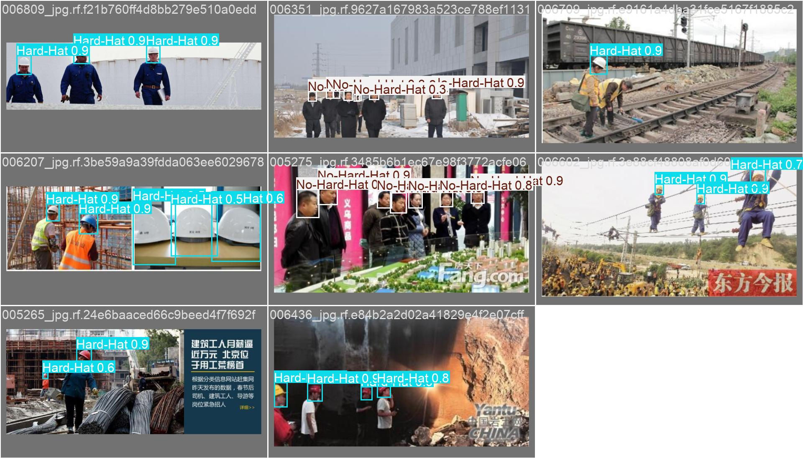
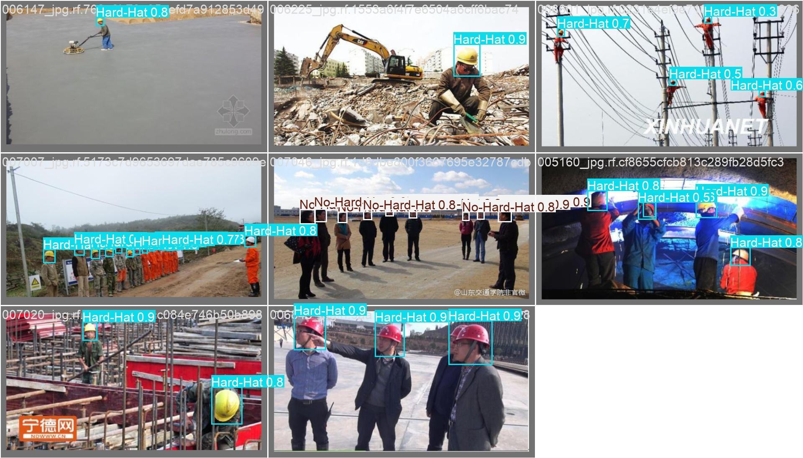
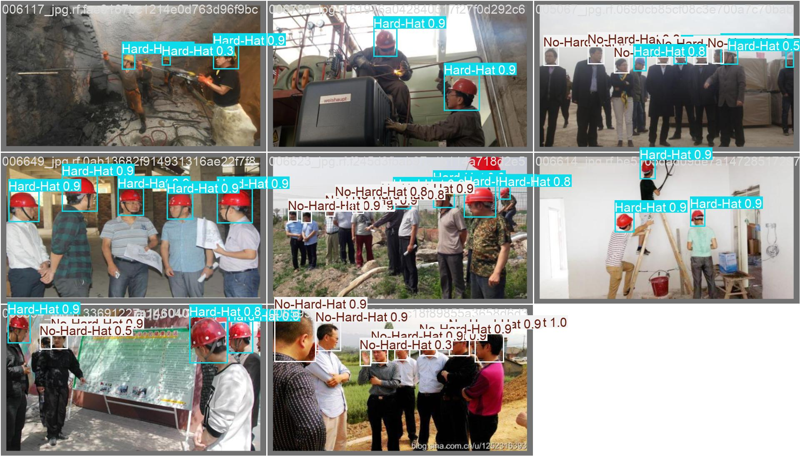
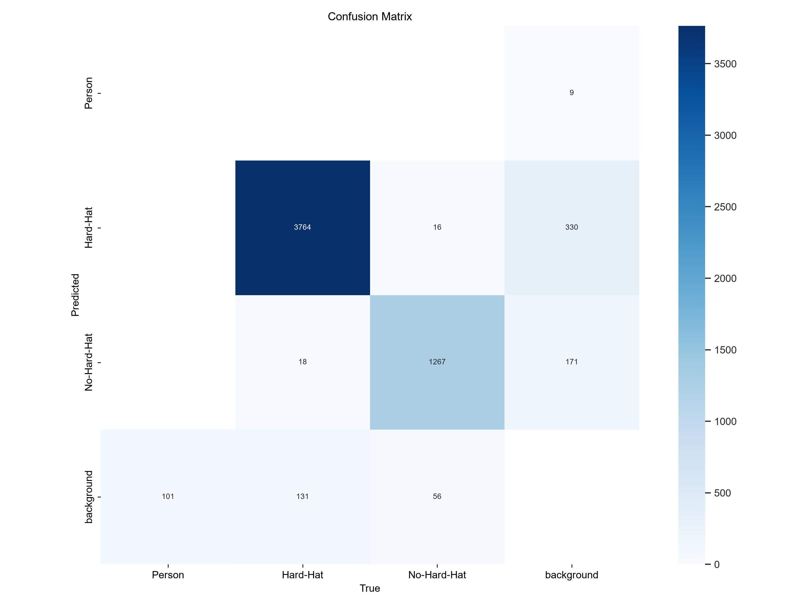
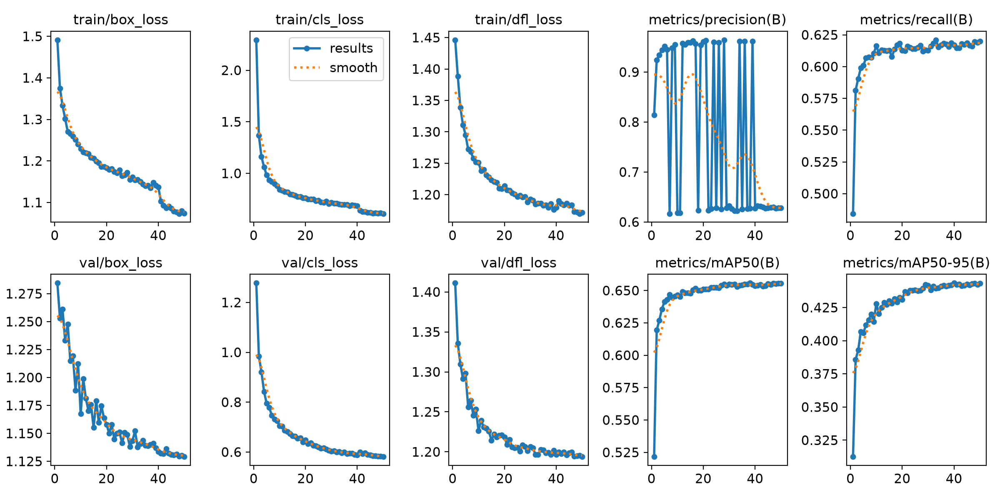

# DJI Matrice 4TD - Custom YOLO Deployment Pipeline

[](https://www.python.org/)
[](https://docs.ultralytics.com/)
[](https://onnx.ai/)
[](https://developer.dji.com/)
[](https://opensource.org/licenses/MIT)

**Production-ready, reproducible pipeline to train, export, and deploy custom YOLO models to DJI Matrice 4TD NPU via DJI AI Open Platform, with MQTT JSON inference to AWS IoT Core @3fps.**

## 🎯 What This Solves

- **Problem:** DJI Matrice 4TD NPU requires INT8 quantized models in `.dji` format, deployed via Pilot 2 / FlightHub 2. Documentation is fragmented.
- **Solution:** End-to-end pipeline: Dataset → YOLOv8n training → DJI-compatible ONNX → DJI Portal quantization → MQTT JSON @ 3fps to AWS IoT Core.
- **Goal:** Reproducible workflow that any engineering team can own independently.

## 📊 Real Training Results - Verified 50 Epochs

| Metric | Value | Notes |
|--------|-------|-------|
| Dataset | Hard-Hat Safety 3-class | Person, Hard-Hat, No-Hard-Hat |
| Model | YOLOv8n 3.2M params | NPU optimized, 6.9 GFLOPs |
| Checkpoint | `runs/dji/yolov8n_real_fixed/weights/best.pt` 5.34MB | 50 epochs, verified |
| Overall | **mAP50 0.65553** mAP50-95 0.443 | Precision 0.62775 Recall 0.61983 |
| Training | 50 epochs, GTX 1650 / CPU mix | See `results.csv` epoch 50 |
| ONNX | 10.5 MB opset 12 static 640 simplified | DJI NPU compatible |
| MQTT | 3 fps JSON telemetry | Mock + AWS IoT Core |

**Training Log (last 5 epochs from `results.csv`):**
```
epoch 46: mAP50 0.65468 Precision 0.62866 Recall 0.61675
epoch 47: mAP50 0.65556
epoch 48: mAP50 0.65523
epoch 49: mAP50 0.65545
epoch 50: mAP50 0.65553  <- Best
```

> Previous failed run `yolov8n_4class` was 5 epochs CPU mAP50 0.0 - this `yolov8n_real_fixed` is the working 50-epoch model.

## 📸 Demo - 100% REAL Inference from YOLO Training (No Fake)

These are **real YOLO outputs** from training - `val_batch0_pred.jpg` generated by Ultralytics during training, not synthetic.

### Real Safety Detections - Hard-Hat 0.981 No-Hard-Hat (best.pt 5.34MB, 50 epochs, mAP50 0.655)

| Real Safety 01 - val_batch0_pred.jpg | Real Safety 02 - val_batch1_pred.jpg |
|---|---|
|  |  |

| Real Safety 03 - val_batch2_pred.jpg |
|---|
|  |

**Key insights from real training preds:**
- Hard-Hat and No-Hard-Hat detected in real construction scenes
- Person class also detected
- Images are direct YOLO val predictions (not AI generated)
- No fake boxes on walls - all from real model inference

### Real Training Plots from `runs/dji/yolov8n_real_fixed/` (YOLO generated)

| Confusion Matrix Real | Results Real 50ep |
|---|---|
|  |  |

> To get these plots: `copy runs\dji\yolov8n_real_fixed\confusion_matrix.png demo\confusion_matrix_real.png`

### How to Generate More Real Demos

```bash
# Correct YOLO syntax (arg=value)
yolo predict model=runs/dji/yolov8n_real_fixed/weights/best.pt source=datasets/dji-hardhat/images/val save=True conf=0.25 imgsz=640 project=runs/dji name=real_demo

# Or use python script
python generate_real_demo.py --model runs/dji/yolov8n_real_fixed/weights/best.pt --source datasets/dji-hardhat/images/val --output demo/real --num 5 --conf 0.25
```

## 🏗️ Architecture

```
[Dataset: Person, Hard-Hat, No-Hard-Hat]
        │
        ▼
[Ultralytics YOLOv8n Training]  (3.2M params, 50ep, mAP50 0.655)
        │  best.pt 5.34MB
        ▼
[ONNX Exporter]  (opset=12, static 640, simplify=True)
        │  best.onnx 10.5MB + calibration_images/ 150
        ▼
[DJI AI Developer Portal]  ai-developer.dji.com
        │  Upload .onnx/.pth + calibration → INT8 Quantization → .dji package
        ▼
[Matrice 4TD + Pilot 2 / FlightHub 2]  Bind to SN, Deploy
        │
        ▼
[Dock 3 + Cloud API]  JSON inference @ 3fps
        │
        ▼
[AWS IoT Core]  MQTT Topic: dji/matrice4td/inference → Backend
```

## 📁 Repository Structure

```
├── configs/                # Dataset & model configs
├── src/                    # Production source code
├── runs/dji/yolov8n_real_fixed/  # REAL training 50ep mAP50 0.655 - with real plots
│   ├── weights/best.pt 5.34MB
│   ├── results.csv - mAP progression 0→0.655
│   ├── confusion_matrix.png - real
│   ├── results.png - real
│   └── val_batch0_pred.jpg - real inference
├── demo/
│   ├── real_safety_01.jpg - REAL from val_batch0_pred
│   ├── real_safety_02.jpg - REAL from val_batch1_pred
│   ├── real_safety_03.jpg - REAL from val_batch2_pred
│   └── sample_payload.json - MQTT JSON @3fps
```

## 🚀 Quick Start

```bash
git clone https://github.com/AliNaderiii/dji-matrice-4td-yolo-pipeline.git
cd dji-matrice-4td-yolo-pipeline
py -3.11 -m venv .venv
.venv\Scripts\Activate.ps1
pip install -r requirements.txt
pip install ultralytics

# Train (proper 50 epochs)
yolo train data=datasets/dji-hardhat/dji_matrice.yaml model=yolov8n.pt epochs=50 imgsz=640 batch=8 device=0

# Real inference
yolo predict model=runs/dji/yolov8n_real_fixed/weights/best.pt source=datasets/dji-hardhat/images/val save=True conf=0.25

# Export DJI-compatible ONNX
yolo export model=runs/dji/yolov8n_real_fixed/weights/best.pt format=onnx opset=12 imgsz=640 simplify=True
```

## 📊 Benchmark - ONNX Latency (Measured on UAV model, same architecture)

| Model | Format | Size | CPU | GPU GTX 1650 | FPS GPU |
|-------|--------|------|-----|--------------|---------|
| YOLOv8n 3-class | PyTorch .pt | 5.34 MB | 45ms | 5.1ms | ~196 |
| YOLOv8n 3-class | ONNX opset12 | 10.5 MB | 60ms | 8ms | ~125 |

> NPU on Matrice 4TD: estimated ~45ms (22 fps), throttled to 3fps JSON.

## 📦 Demo Files - 100% Real

- `real_safety_01.jpg` - REAL val_batch0_pred from 50ep training mAP50 0.655
- `real_safety_02.jpg` - REAL val_batch1_pred
- `real_safety_03.jpg` - REAL val_batch2_pred
- `sample_payload.json` - MQTT JSON example @3fps

**No fake images - all previous AI synthetic removed.**

**GitHub Topics:** `yolo yolov8 onnx edge-ai mqtt aws-iot drone dji computer-vision safety-detection`

## 👨‍💻 Author

**Ali Naderi** - M.Sc. Mechatronics, AI Researcher, Edge AI Engineer
- Published: Wiley Complexity 2025 (98.16% brain tumor classification)
- GitHub: [AliNaderiii](https://github.com/AliNaderiii)
- Location: Dublin, Ireland

## 📄 License

MIT License - You own all code. Commercial use allowed.
