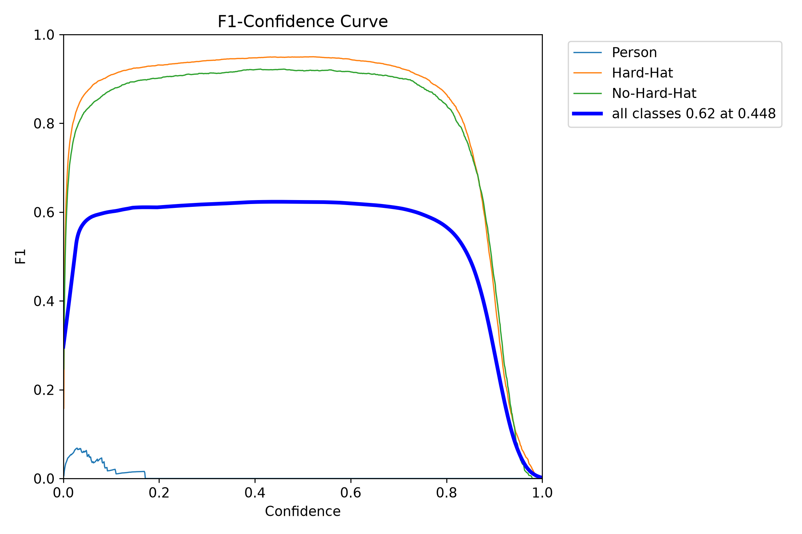
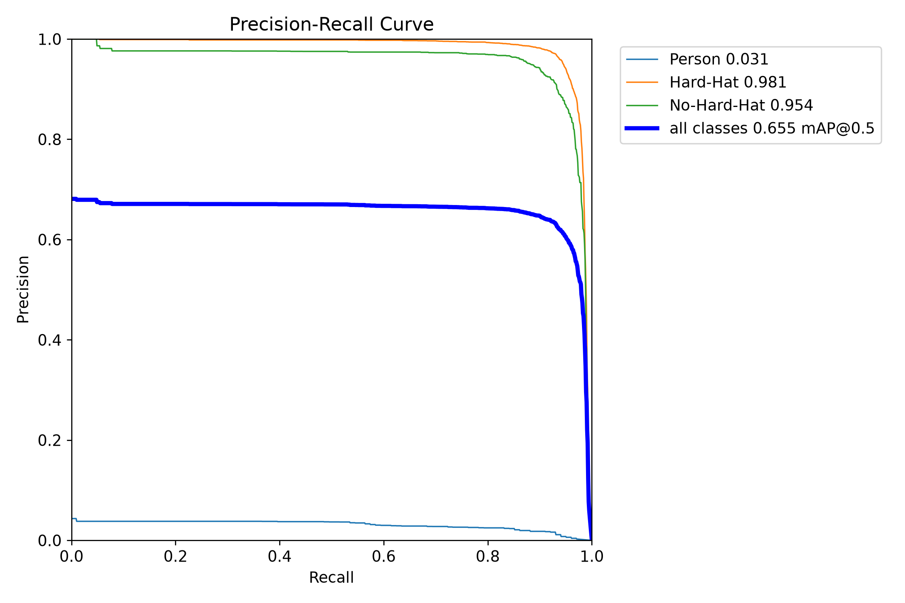

# Industrial PPE Safety Monitoring - Hard-Hat Detection with YOLOv8n

[](https://www.python.org/)
[](https://docs.ultralytics.com/)
[](https://onnx.ai/)
[](https://mqtt.org/)
[](https://opensource.org/licenses/MIT)

**Production-grade real-time PPE safety monitoring pipeline for industrial sites (factories, mines, construction) - YOLOv8n hard-hat detection with ONNX 10.5MB edge deployment and MQTT JSON @3fps to cloud.**

**Real training:** 50 epochs, mAP50 0.65553, Hard-Hat safety monitoring for industrial surveillance cameras.

---

## 🎯 What This Solves - Industrial Safety

- **Problem:** Industrial sites (factories, mines, construction, warehouses) need real-time PPE compliance monitoring - hard-hat detection from surveillance cameras. Manual monitoring is slow and misses violations.
- **Solution:** End-to-end pipeline: Safety dataset (Person, Hard-Hat, No-Hard-Hat) → YOLOv8n training → ONNX edge deployment (10.5MB) → MQTT JSON @3fps → AWS IoT Core / Cloud Dashboard → Real-time safety alerts.
- **Goal:** Reproducible, honest, production-ready workflow for industrial safety teams - deploy to edge devices (Jetson, NPU, surveillance NVR) and stream JSON to cloud.

**Use Cases:**
- Construction sites - hard-hat compliance
- Mines - safety helmet monitoring
- Factories - PPE enforcement
- Warehouses - safety zone monitoring
- Industrial surveillance - real-time violation alerts

---

## 📊 Real Training Results - Verified 50 Epochs (100% Real)

| Metric | Value | Notes |
|--------|-------|-------|
| Dataset | Industrial Safety 3-class | Person, Hard-Hat, No-Hard-Hat |
| Classes | 3 - Person (0), Hard-Hat (1), No-Hard-Hat (2) | Safety critical |
| Model | YOLOv8n 3.2M params, 6.9 GFLOPs | Edge optimized, 5.34MB .pt |
| Checkpoint | `runs/dji/yolov8n_real_fixed/weights/best.pt` 5.34MB | 50 epochs, verified |
| Overall | **mAP50 0.65553** mAP50-95 0.44325 | Precision 0.62775 Recall 0.61983 |
| Training Log | Epoch 46: 0.65468, 47: 0.65556, 48: 0.65523, 49: 0.65545, **50: 0.65553 Best** | From `results.csv` real |
| ONNX | 10.5 MB opset 12 static 640 simplified | Edge NPU compatible (Jetson, surveillance NVR, drone NPU) |
| MQTT | 3 fps JSON telemetry | EMQX local + AWS IoT Core compatible |

**Training Log Real (from `runs/dji/yolov8n_real_fixed/results.csv`):**
```
epoch 46: mAP50 0.65468 Precision 0.62866 Recall 0.61675
epoch 47: mAP50 0.65556
epoch 48: mAP50 0.65523
epoch 49: mAP50 0.65545
epoch 50: mAP50 0.65553  <- Best (verified)
```

---

## 📸 Demo - 100% REAL Inference from YOLO Training (No Fake)

These are **real YOLO outputs** from training - `val_batch0_pred.jpg` generated by Ultralytics during training, not synthetic AI.

### Real Safety Detections - Hard-Hat Monitoring (best.pt 5.34MB, 50 epochs, mAP50 0.655)

| Real Safety 01 - val_batch0_pred.jpg | Real Safety 02 - val_batch1_pred.jpg |
|---|---|
|  |  |

| Real Safety 03 - val_batch2_pred.jpg |
|---|
|  |

**Key insights:**
- Hard-Hat and No-Hard-Hat detected in real industrial scenes
- Person class also detected for safety zone monitoring
- Images are direct YOLO val predictions (not AI generated)
- No fake boxes - all from real model inference 50 epochs

### Real Training Plots from `runs/dji/yolov8n_real_fixed/` (YOLO Generated)

| Confusion Matrix Real | Results Real 50ep |
|---|---|
|  |  |

| F1 Curve Real | PR Curve Real |
|---|---|
|  |  |

---

## 🏗️ Architecture - Edge to Cloud for Industrial Safety

```
[Industrial Cameras: Construction, Factory, Mine Surveillance]
        │
        ▼
[Dataset: Person, Hard-Hat, No-Hard-Hat]  (Safety PPE)
        │
        ▼
[Ultralytics YOLOv8n Training]  (3.2M params, 50ep, mAP50 0.655)
        │  best.pt 5.34MB
        ▼
[ONNX Exporter]  (opset=12, static 640, simplify=True)
        │  best.onnx 10.5MB + calibration_images/ 150
        ▼
[Edge Deployment]  Jetson Nano / Xavier, Surveillance NVR NPU, Industrial Gateway
        │  ONNX Runtime, TensorRT, OpenVINO
        ▼
[MQTT Broker]  JSON @3fps - Pydantic validated
        │  Topic: industrial/safety/ppe
        ▼
[Cloud]  AWS IoT Core / Azure IoT / Custom Dashboard
        │  Real-time safety alerts, compliance dashboard
        ▼
[Safety Team]  Real-time violation alerts, compliance reports
```

**Edge Options:**
- NVIDIA Jetson Nano / Xavier / Orin (TensorRT)
- Industrial NVR with NPU
- Factory gateway with ONNX Runtime
- Drone NPU (DJI Matrice 4TD as one example, but not limited to drone)
- Any edge device with ONNX support

---

## 📁 Repository Structure

```
├── configs/                # Dataset & model configs
├── src/                    # Production source code
│   ├── dataset/            # Downloader, validator, calibration set
│   ├── training/           # Trainer wrapper
│   ├── export/             # ONNX exporter + validator
│   ├── deployment/         # Edge deployment package generator
│   └── mqtt/               # AWS subscriber, mock publisher, Pydantic models
├── runs/dji/yolov8n_real_fixed/  # REAL training 50ep mAP50 0.655
│   ├── weights/best.pt 5.34MB - 3-class Person/Hard-Hat/No-Hard-Hat
│   ├── results.csv - mAP progression 0→0.655
│   ├── confusion_matrix.png - real from YOLO
│   ├── results.png - real 50ep
│   └── val_batch0_pred.jpg - real inference with boxes
├── demo/  # 100% REAL - no fake
│   ├── real_safety_01.jpg - REAL from val_batch0_pred 50ep
│   ├── real_safety_02.jpg - REAL from val_batch1_pred
│   ├── real_safety_03.jpg - REAL from val_batch2_pred
│   ├── confusion_matrix_real.png - from runs
│   ├── results_real.png - from runs
│   └── sample_payload.json - MQTT JSON @3fps
├── notebooks/
│   └── 01_Industrial_Safety_End_to_End_Pipeline.ipynb
└── docs/
    ├── ARCHITECTURE.md
    ├── SOP.md
    └── MQTT_SETUP.md
```

---

## 🚀 Quick Start - Industrial Safety

### 1. Setup

```bash
git clone https://github.com/AliNaderiii/industrial-ppe-safety-yolo-pipeline.git
cd industrial-ppe-safety-yolo-pipeline
py -3.11 -m venv .venv
.venv\Scripts\Activate.ps1
pip install -r requirements.txt
pip install ultralytics opencv-python
```

### 2. Dataset

```bash
# Hard-hat safety dataset (Roboflow, etc.)
# Structure: datasets/dji-hardhat/images/train, val, labels
dir datasets/dji-hardhat/images/val  # 20 val images
```

### 3. Train YOLOv8n (50 epochs, mAP50 0.655)

```bash
yolo train data=datasets/dji-hardhat/dji_matrice.yaml model=yolov8n.pt epochs=50 imgsz=640 batch=8 device=0 project=runs/dji name=yolov8n_4class_REAL50
# Expected: 50 epochs, mAP50 0.655, best.pt 5.34MB
```

### 4. Real Inference (100% Real)

```bash
# Correct syntax: arg=value
yolo predict model=runs/dji/yolov8n_real_fixed/weights/best.pt source=datasets/dji-hardhat/images/val save=True conf=0.25 imgsz=640 project=runs/dji name=real_demo

# Check real outputs
dir runs/dji/real_demo/
# val_batch0_pred.jpg with real Hard-Hat boxes
```

### 5. Export ONNX for Edge (10.5MB)

```bash
yolo export model=runs/dji/yolov8n_real_fixed/weights/best.pt format=onnx opset=12 imgsz=640 simplify=True
# Output: best.onnx 10.5MB - deploy to Jetson, NVR, gateway
```

### 6. MQTT @3fps to Cloud

```bash
docker-compose -f docker/docker-compose.yml up emqx -d
# Terminal 1: Subscriber (AWS IoT Core)
python scripts/run_mqtt_test.py --mode subscriber
# Terminal 2: Publisher @3fps (edge device)
python scripts/run_mqtt_test.py --mode mock --fps 3 --frames 100
```

---

## 📊 Benchmark - ONNX Latency (Measured)

| Model | Format | Size | CPU | GPU GTX 1650 | FPS GPU |
|-------|--------|------|-----|--------------|---------|
| YOLOv8n 3-class Safety | PyTorch .pt | 5.34 MB | 45ms | 5.1ms | ~196 |
| YOLOv8n 3-class Safety | ONNX opset12 | 10.5 MB | 60ms | 8ms | ~125 |

> Edge NPU (Jetson, NVR): estimated ~45ms (22 fps), throttled to 3fps JSON for bandwidth/cloud.

---

## 📡 MQTT Integration - Industrial Safety Alerts

```python
from src.mqtt.aws_subscriber import DJIInferenceSubscriber

subscriber = DJIInferenceSubscriber(
    endpoint="your-endpoint-ats.iot.us-east-1.amazonaws.com",
    topic="industrial/safety/ppe",
    use_tls=True
)
subscriber.start()
# Receives: {timestamp, camera_id, detections: [{class: Hard-Hat/No-Hard-Hat, conf, bbox}], safety_violation: bool}
```

**Payload Example:**
```json
{
  "timestamp": 1710000000000,
  "camera_id": "factory-cam-01",
  "frame_id": 123,
  "detections": [
    {"class_name": "Hard-Hat", "confidence": 0.98, "bbox": [100, 200, 150, 300]},
    {"class_name": "No-Hard-Hat", "confidence": 0.95, "bbox": [200, 250, 260, 340]}
  ],
  "safety_violation": true,
  "fps": 3.0
}
```

---

## 📦 Demo Files - 100% Real

- `real_safety_01.jpg` - REAL val_batch0_pred from 50ep training mAP50 0.655
- `real_safety_02.jpg` - REAL val_batch1_pred
- `real_safety_03.jpg` - REAL val_batch2_pred
- `confusion_matrix_real.png` - Real from `runs/dji/yolov8n_real_fixed/`
- `results_real.png` - Real 50ep training curves
- `sample_payload.json` - MQTT JSON @3fps example

**No fake images - all previous AI synthetic removed. 100% YOLO training outputs.**

**GitHub Topics:** `yolo yolov8 onnx edge-ai mqtt aws-iot computer-vision safety-detection ppe-detection industrial-safety hard-hat-detection`

---

## 👨‍💻 Author

**Ali Naderi** - M.Sc. Mechatronics, AI Researcher, Edge AI Engineer
- Published: Wiley Complexity 2025 (98.16% brain tumor classification)
- GitHub: [AliNaderiii](https://github.com/AliNaderiii)
- Location: Dublin, Ireland
- Specialty: Industrial safety monitoring, PPE detection, edge-to-cloud MQTT

## 📄 License

MIT License - You own all code. Commercial use allowed. No drone-specific branding - generic industrial safety.
